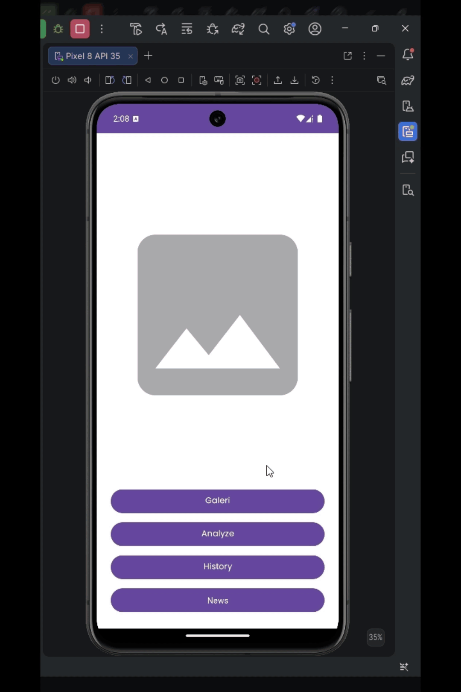

# Android Application Asclepius — Dicoding Submission

## About
Asclepius is an Android application developed as part of a Dicoding certification program, focusing on the implementation of Machine Learning on Android.

This project explores the fundamental concepts required to integrate Machine Learning capabilities into Android applications, including ML Kit, TensorFlow Lite, MediaPipe, and Firebase Machine Learning.

The project provides hands-on experience in understanding how Machine Learning technologies can be integrated into mobile applications and used as part of an Android development workflow.

## Tech Stack
| Category |	Technology |
| ---- | ---- |
| Language |	Kotlin |
| Platform |	Android |
| ML Framework |	TensorFlow Lite |
| ML Services |	Google ML Kit |
| Computer Vision |	MediaPipe |
| Cloud ML |	Firebase Machine Learning |
